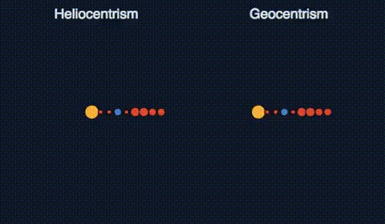

# SciFi UI Project

Name: Conor Maguire

Student Number: D18124735

# Description of the assignment

The idea for this assignment was to recreate an interactable version of the gif below, were one could select which solar body (sun or planet) is to be at the centre and see the different pattern that orbiting solar planets would make. This was to in clue a pause button that could and the ability to measure the distance between the planets given in AU (Astronomical Units) at any point by clicking on them.



# Instructions

Create a bin folder in SciFiUI/Java

Compile and run programme in git bash

./complie.sh
./run.sh

# How it (ment to) works

The planetary information is read in from the file Planets.csv were it is loaded into an Array List of planet objects called planets. These are then to be rendered on the screen with their positions dictated by their relative distance from the sun (Sol). The Sun is use because all planets revolve around it in real life, this means that the pattern produced only changes based on which planet is chosen to be at the centre of the screen. The space bar was to act as a pause button so that the planets could be clicked on more easily, the distance between them would be displayed at the bottom of the screen.

# What I am most proud of in the assignment

Not really a whole lot, I failed to get the planets to rotate, the function to do this spin() moves them the origin and I have no idea why. So, it’s simple commented out. Beyond this the distance calculator works and the size of the planets are scaled correctly, the log of their diameter was taken so that a planet 10 times the size of another would be twice as big. The same goes for the distance between them, but it was also considered that the planets should have the option to be spaces evenly because they overlap as such the was to switch to toggle between the two modes.

# Markdown Tutorial

This is *emphasis*

This is a bulleted list

- Item
- Item

This is a numbered list

1. Item
1. Item

This is a [hyperlink](http://bryanduggan.org)

# Headings
## Headings
#### Headings
##### Headings

This is code:

```Java
public void render()
{
	ui.noFill();
	ui.stroke(255);
	ui.rect(x, y, width, height);
	ui.textAlign(PApplet.CENTER, PApplet.CENTER);
	ui.text(text, x + width * 0.5f, y + height * 0.5f);
}
```

So is this without specifying the language:

```
public void render()
{
	ui.noFill();
	ui.stroke(255);
	ui.rect(x, y, width, height);
	ui.textAlign(PApplet.CENTER, PApplet.CENTER);
	ui.text(text, x + width * 0.5f, y + height * 0.5f);
}
```

This is an image using a relative URL:


This is an image using an absolute URL:


This is a youtube video:

[](https://www.youtube.com/watch?v=J2kHSSFA4NU)

This is a table:

| Heading 1 | Heading 2 |
|-----------|-----------|
|Some stuff | Some more stuff in this column |
|Some stuff | Some more stuff in this column |
|Some stuff | Some more stuff in this column |
|Some stuff | Some more stuff in this column |

